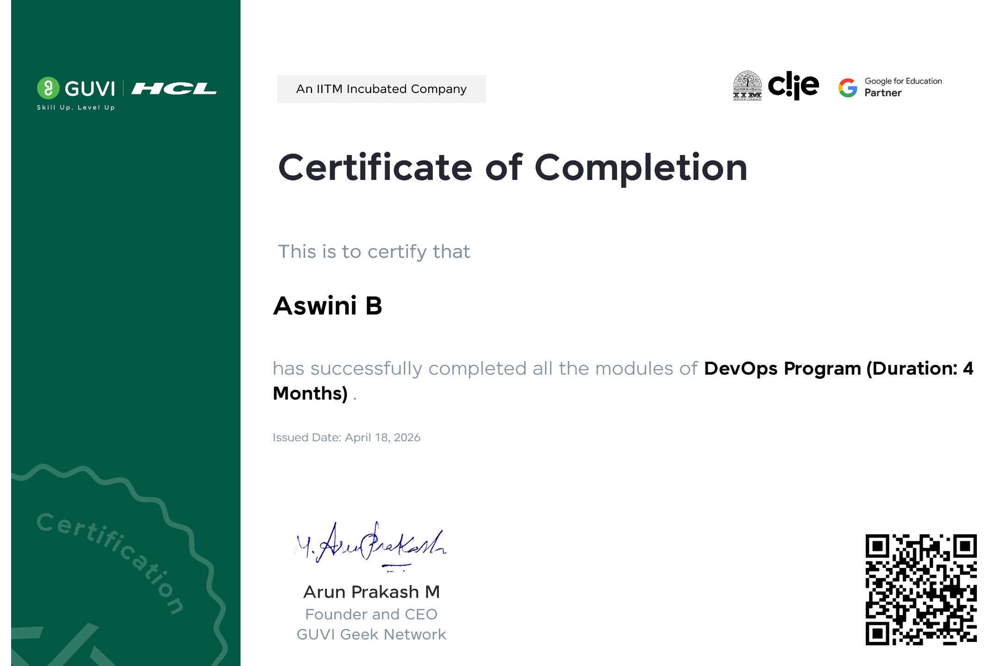

# 🚀 DevOps Hands-On Labs – GUVI DevOps Program

---

## 👩‍💻 About Me

I'm **Aswini B**, a Telecom Deployment Engineer with 3 years of experience in Nokia Telephony Application Server (NTAS/MCS R22), specializing in IMS/VoLTE solutions. I completed a **4-month DevOps Program** from **GUVI Geek Network** (IITM Incubated & Google for Education Partner) to expand my skills into cloud and DevOps technologies.

🔗 [LinkedIn](https://www.linkedin.com/in/aswini-baskar-2680b9197/)

---

## 📋 About This Repository

This repository contains my hands-on lab tasks and assignments completed as part of the **GUVI DevOps Program**. Each task is documented with screenshots as proof of execution.

---

## ☁️ AWS Hands-On Labs

| Task | Description |
|------|-------------|
| **EC2 Instance** | Launched Linux & Windows servers on AWS EC2 |
| **S3 Bucket** | Created S3 bucket and uploaded files |
| **VPC Setup** | Created VPC, Subnets, Internet Gateway & Route Tables |
| **EBS Volume** | Created and attached EBS volumes to EC2 instances |
| **AWS Lambda** | Created and configured a Lambda function with triggers |
| **AWS CodeDeploy** | Set up CodeDeploy agent and deployed code successfully |
| **CloudWatch** | Created log groups and viewed logs for monitoring |
| **Apache Web Server** | Installed and configured Apache on Linux EC2 |
| **Linux Shell Scripting** | File permissions, error code check scripts |
| **Windows Server** | RDP connection, IIS setup, system info via CMD/PowerShell |

---

## 🛠️ Tools & Technologies Covered

- **Cloud:** AWS (EC2, S3, VPC, EBS, Lambda, CodeDeploy, CloudWatch)
- **DevOps:** Docker, Kubernetes, Jenkins CI/CD, Ansible, Terraform
- **Version Control:** Git & GitHub
- **Monitoring:** Prometheus & Grafana
- **OS & Scripting:** Linux, Shell Scripting, Windows Server

---

## 🏅 Certification

**DevOps Program (4 Months)**
GUVI Geek Network — IITM Incubated & Google for Education Partner
📅 Issued: April 2026

> Certificate is available in this repository as proof.

---

## 📬 Contact

- 📧 aswini.raji1998@gmail.com
- 🔗 [LinkedIn](https://www.linkedin.com/in/aswini-baskar-2680b9197/)
